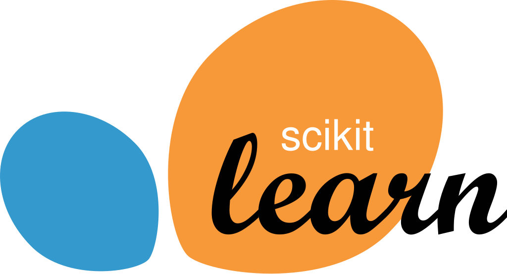
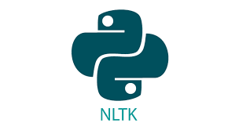
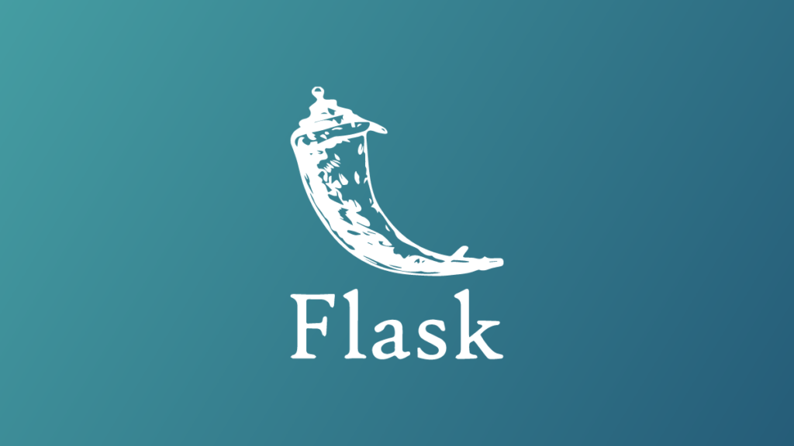

<h1 align = 'center'>Hi , I'm Akshwin T 👋👋</h1>

<h2 align = 'center'>I'm a passionate Data Scientist, AI Enthusiast, and a Java Programmer</h2>

 
  
  

  <!-- Profile Views -->

  

<h1 align = 'center'>Infusing Human Intelligence with Artificial Intelligence </h1>
  

  

## 🧑‍🎓 About Me :

- 👨‍🎓 I'm CS Prefinal Year Student at VIT, Vellore.
- 👨‍💻 I'm passionate about Data Science, Artificial Intelligence, and Competitive Coding.
- 🔭 I’m currently working on **Advanced AI Applications**
- 🌱 I’m currently learning **Technologies in the field of  AI and Data Science**
- 👯 I’m looking to collaborate on **Projects based on Machine Learning, Artificial Intelligence, Deep Learning and Computer Vision**
- 🌱 I’m currently learning **Technologies in the field of  AI and Data Science**
- 💡 Ask me about **Human Neurons or AI Neurons**
- 👨‍💻 All of my projects are available at [https://github.com/akshwin](https://github.com/akshwin)

## 🌐 Socials : 

  
  
  
  

  <!--  -->

<!--### 💻 Tech Stack :-->

<!-- 

 -->

### 📔 Hacktoberfest Badges :

## 📈  Stats : 
<table align="center">
  <tr>
    <td></td>
  </tr> 
</table>

<table align="center">
  <tr>
    <td></td>
  </tr> 
</table>

<table align="center">
  <tr>
    <td></td>
  </tr> 
</table>

