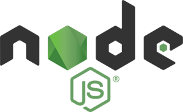
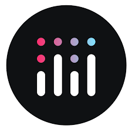
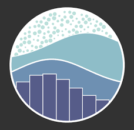
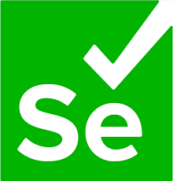

<h1 align = 'center'>Hi , I'm Akshwin T 👋👋</h1>
<h2 align = 'center'> Data Science Enthusiast | AI Researcher | ML Practitioner </h2>

 
  
  

  

  

  

## 🧑‍🎓 About Me :

- 👨‍🎓 I'm CS Final Year Student at VIT, Vellore.
- 👨‍💻 I'm passionate about Data Science, Artificial Intelligence, and Machine Learning.
- 🔭 I’m currently working on **Advanced AI Applications.**
- 🌱 I’m currently learning **Technologies in the field of  AI and Data Science.**
- 👯 I’m looking to collaborate on **Projects based on Machine Learning, Artificial Intelligence, Deep Learning and Computer Vision.**
- 💡 Ask me about **Human Neurons or AI Neurons.**

## 🌐 Socials : 

  
  
  
  

  <!--  -->

## 💻 Tech Stack :

<h3 align="center">Packages and Libraries (For ML, DL and CV)</h3>

     

<h3>Programming Languages and Tools</h3>

 </a>
 </a>
 </a>
 </a>
 </a>
 </a>
 </a>
 </a>
 </a>
 </a>
 </a>
 </a>
 </a>
 </a>
 </a>
 </a>
 </a>
 </a>
 </a>
 </a>
 </a>
 </a>
 </a>
 </a>
 </a>
 </a>
 </a>
 </a>

### 📔 Hacktoberfest Badges :

## 📈  Stats : 
<table align="center">
  <tr>
    <td></td>
  </tr> 
</table>

<table align="center">
  <tr>
    <td></td>
  </tr> 
</table>

<table align="center">
  <tr>
    <td></td>
  </tr> 
</table>
